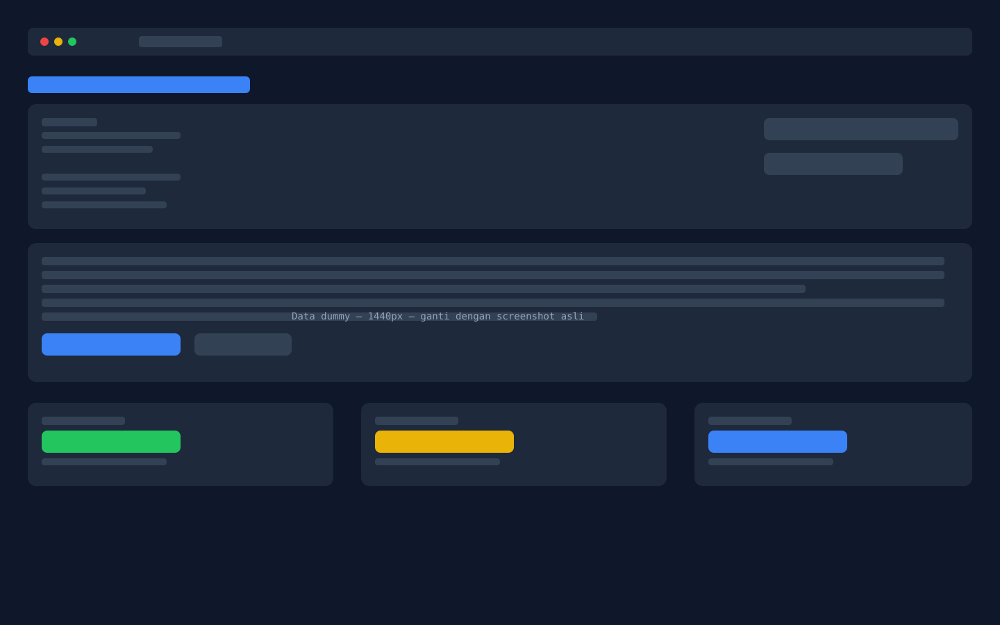

# Portfolio — Fauzan

Personal portfolio website built with Next.js, TypeScript, Tailwind CSS, and Framer Motion.

## Preview



> Ganti screenshot di atas dengan tangkapan layar asli 1440px.

## Features

- **Hero section** — two-column layout, gradient orb background, staggered animations
- **About section** — personal narrative, career goals, mini timeline, highlight stats
- **Skills section** — categorized tech stack badges (Frontend, Backend, Database, Tools, AI Tools)
- **Projects section** — featured project with screenshot, features list, "Problem Solved" highlight
- **AI Workflow section** — animated 6-step pipeline, 4 use case cards, tools used, disclaimer
- **Responsive** — mobile-first, tested at 375px / 768px / 1440px
- **Dark theme** — consistent `#0f172a`-based palette

## Tech Stack

| Category | Technologies |
|---|---|
| Framework | Next.js 16 (App Router) |
| Language | TypeScript |
| Styling | Tailwind CSS v4 |
| Animation | Framer Motion |
| Icons | react-icons (Heroicons, Simple Icons) |
| Font | Inter + JetBrains Mono via `next/font` |
| Deployment | Vercel |

## Getting Started

```bash
npm install
npm run dev
```

Open [http://localhost:3000](http://localhost:3000).

### Build

```bash
npm run build
npm start
```

## Project Structure

```
src/
├── app/          # Layout, pages, globals.css
├── components/   # Reusable UI (Container, SectionDivider, ProjectSkeleton)
├── data/         # Editable content (site, about, skills, projects, ai-workflow)
├── sections/     # Page sections (Navbar, Hero, About, Skills, Projects, AiWorkflow)
└── styles/       # Reserved for future style utilities
```

All content is in `src/data/` — edit without touching JSX.
